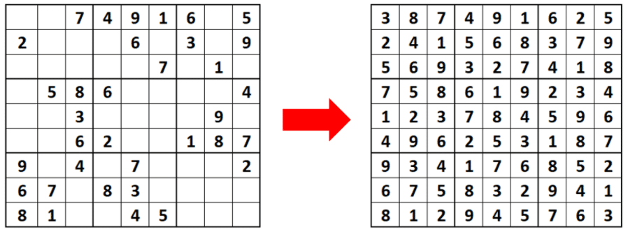
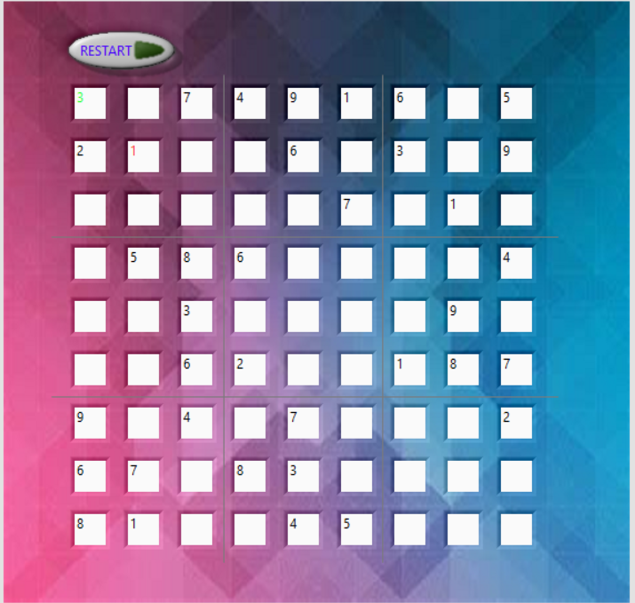

# Sudoku_on_Labview
Implementation of a Sudoku game using Labview software.

## Reference:
This game was implemented by following this model: 
<https://forums.ni.com/t5/Example-Code/Simple-Sudoku-Game-Using-LabVIEW/ta-p/3508428>

## Goal:
Solving this puzzle:

 

## Interface (HIM):
Here is a look of the game interface:

 

### Digits color code:
* The cases with black digit are present by default.
* The one in green is a number entered by the player and a good guess.
* The one in red is a number entered by the player and a wrong guess.

## Block diagram:
### State 0:
Here is a look of the block diagram when the player change the value of one of the sudoku cases:

 
