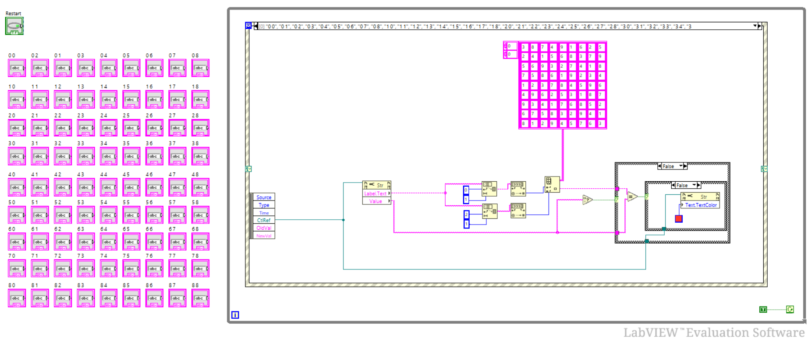
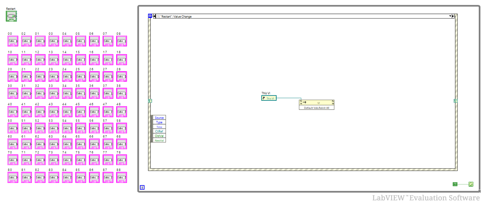

# Sudoku_on_Labview
Implementation of a Sudoku game using Labview software.

## Reference:
This game was implemented by following this model: 
<https://forums.ni.com/t5/Example-Code/Simple-Sudoku-Game-Using-LabVIEW/ta-p/3508428>

## Goal:
Solving this puzzle:

 

## Interface (HIM):
Here is a look of the game interface:

 

### Digits color code:
* The cases with black digit are present by default.
* The one in green is a number entered by the player and a good guess.
* The one in red is a number entered by the player and a wrong guess.

## Block diagram:
The block diagram is constituated of a while loop to allow the player to have a continuous game, this block contains an event structure with 2 states:

### State 0:
Here is a look of the block diagram when the player changes the value of one of the sudoku cases:

 

#### Steps:
* The event structure will be activated for any string control modification in the sudoku grid and run the state 0.
* The name of the activated string control corresponds to its position in the grid and its value will be compared to the corresponding index value in the reference array.
* The first case strucutre will verify if the case is not empty.
* The inner case structure will verify if the reference value and the player value are identical: if true -> green, if false -> red.

### State 1:
Here is a look of the block diagram when the player clicks on the restart button:

 

### Steps:
* When the player is pressing the restart button, the event structure will run the state 1.
* The VI will be reset to its initial state.

 
